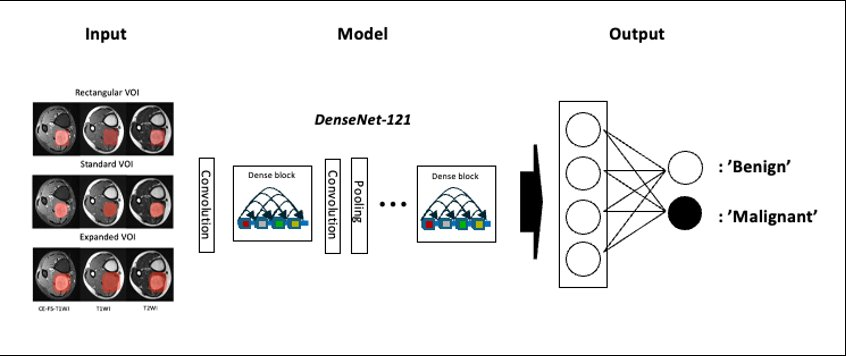

# Influence of VOI Expansion on Deep Learning–based Classification of Soft Tissue Tumors on MRI

[](https://www.python.org/)
[](https://pytorch.org/)
[](https://monai.io/)
[](LICENSE)

Official implementation of:

> **Influence of Voxel-of-Interest Expansion on Deep Learning-based Classification of Soft Tissue Tumors on MRI**
>
> *Investigative Magnetic Resonance Imaging (iMRI), 2026*

---

## Overview

This repository provides the training and external validation code for a DenseNet-121–based classification model that distinguishes benign from malignant soft tissue tumors (STTs) on multi-sequence MRI. We investigate the effect of expanding the voxel-of-interest (VOI) beyond the tumor margin on diagnostic performance.

Three VOI strategies are compared:

| Model | VOI Type | Description |
|:---:|:---:|:---|
| Model 1 | **R-VOI** | Rectangular bounding box enclosing the tumor |
| Model 2 | **S-VOI** | Standard tumor segmentation mask |
| Model 3 | **E-VOI** | 1 cm peritumoral expansion beyond the tumor boundary |

<p align="center">
  
</p>

### Key Findings

- **E-VOI achieved the highest AUC** among the three models in both internal and external validation
- Incorporating peritumoral regions improved diagnostic performance and model interpretability
- Occlusion-based heatmaps demonstrated pronounced activation in the peritumoral region for E-VOI

---

## Results

### Internal Validation (5-Fold Cross-Validation, n = 125)

| Model | AUC [95% CI] | Sensitivity [95% CI] | Specificity [95% CI] |
|:---:|:---:|:---:|:---:|
| R-VOI | 0.775 [0.672, 0.844] | 0.722 [0.584, 0.835] | **0.817** [0.707, 0.899] |
| S-VOI | 0.769 [0.677, 0.841] | 0.833 [0.707, 0.921] | 0.676 [0.555, 0.782] |
| E-VOI | **0.789** [0.696, 0.858] | **0.833** [0.707, 0.921] | 0.690 [0.569, 0.795] |

### External Validation (n = 58)

| Model | AUC [95% CI] | Sensitivity [95% CI] | Specificity [95% CI] |
|:---:|:---:|:---:|:---:|
| R-VOI | 0.834 [0.732, 0.936] | 0.900 [0.683, 0.988] | 0.553 [0.383, 0.714] |
| S-VOI | 0.816 [0.704, 0.928] | 0.950 [0.751, 0.999] | 0.368 [0.218, 0.540] |
| E-VOI | **0.849** [0.748, 0.949] | 0.900 [0.683, 0.988] | **0.632** [0.460, 0.782] |
| Reader 1 | 0.909 [0.837, 0.981] | 0.850 [0.621, 0.968] | 0.868 [0.719, 0.956] |
| Reader 2 | 0.755 [0.631, 0.880] | 0.750 [0.509, 0.913] | 0.684 [0.513, 0.825] |

---

## Repository Structure

```
DL-STT-VOI-expansion-validlab/
├── README.md                  # This file
├── USAGE_GUIDE.md             # Step-by-step training & evaluation guide
├── REPRODUCTION.md            # Complete parameter documentation
├── train_5cv.py               # Unified 5-fold CV training (S/E/R-VOI)
├── evaluate_external.py       # External validation script
└── main                       # Entry point
```

---

## Requirements

### Hardware
- 2× NVIDIA RTX 4080 (16 GB VRAM each) or equivalent
- 64 GB system RAM
- NVMe SSD recommended

### Software

```bash
pip install torch==2.0.1 torchvision==0.15.2 monai==1.2.0 \
    scikit-learn==1.3.0 pandas==2.0.2 numpy==1.24.3 \
    matplotlib==3.7.1 tqdm==4.65.0 nibabel==5.1.0
```

| Package | Version | Purpose |
|:---|:---:|:---|
| Python | 3.9+ | Runtime |
| PyTorch | 2.0.1+cu118 | Deep learning framework |
| MONAI | 1.2.0 | Medical imaging transforms & DenseNet-121 |
| scikit-learn | 1.3.0 | Cross-validation, metrics |
| NumPy | 1.24.3 | Numerical computation |
| Pandas | 2.0.2 | Data handling |

---

## Data Preparation

### Directory Structure

Each VOI type requires three MRI sequences (T1WI, T2WI, CE-FS-T1WI) and segmentation masks organized as:

```
data_root/
├── EN/                        # Contrast-enhanced fat-suppressed T1WI
│   ├── patient_001/
│   │   ├── image.nii.gz
│   │   └── seg_mask.nii.gz
│   ├── patient_002/
│   │   ├── image.nii.gz
│   │   └── seg_mask.nii.gz
│   └── ...
├── T1/                        # T1-weighted images
│   ├── patient_001/
│   │   └── image.nii.gz
│   └── ...
└── T2/                        # T2-weighted images
    ├── patient_001/
    │   └── image.nii.gz
    └── ...
```

### Label File

A CSV file mapping patient IDs to binary labels:

```csv
patient_id,label
patient_001,0
patient_002,1
...
```

- `0` = benign
- `1` = malignant

---

## Quick Start

### Training (5-Fold Cross-Validation)

```bash
python train_5cv.py \
    --voi_type s_voi \
    --data_root /path/to/data \
    --label_file /path/to/labels.csv \
    --output_dir /path/to/output \
    --epochs 30 \
    --batch_size 32 \
    --lr 5e-5
```

VOI type options: `s_voi`, `e_voi`, `r_voi`

### External Validation

```bash
python evaluate_external.py \
    --voi_type e_voi \
    --model_path /path/to/checkpoint.pth \
    --data_root /path/to/external_data \
    --label_file /path/to/external_labels.csv
```

For detailed instructions, see [USAGE_GUIDE.md](USAGE_GUIDE.md).
For complete parameter specifications, see [REPRODUCTION.md](REPRODUCTION.md).

---

## Citation

If you use this code, please cite:

```bibtex
@article{stt_voi_expansion_2026,
  title={Influence of Voxel-of-Interest Expansion on Deep Learning-based 
         Classification of Soft Tissue Tumors on MRI},
  journal={Investigative Magnetic Resonance Imaging},
  year={2026}
}
```

---

## License

This project is licensed under the MIT License. See [LICENSE](LICENSE) for details.

---

*Last updated: April 12, 2026*
